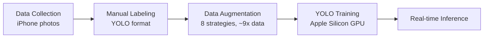

# 🍎 Apple Clusters Detector

[](https://www.python.org/downloads/)
[](https://docs.ultralytics.com/)
[](LICENSE)
[](https://docs.astral.sh/uv/)

Real-time apple cluster detection powered by a custom-trained YOLO model. A complete end-to-end machine learning pipeline — from raw photo collection and data augmentation to model training and live inference.

> Built to detect clusters of apples on trees using real-time video feeds, this project demonstrates the full lifecycle of a computer vision application.

## ✨ Features

- 📷 **Interactive desktop interface**: Launch the app and choose between webcam, photo, or video detection.
- 📸 **Real-time webcam detection**: Highly optimized inference pipeline.
- 📂 **Photo & video detection**: Browse and select files through a native file dialog.
- 💾 **Save results**: Option to save detection results after viewing.
- 🔄 **8 specialized data augmentation strategies**: Maximizes model robustness and accuracy.
- 🔬 **Full reproducible training pipeline**: Scripts available to recreate the training from scratch.
- 📥 **Auto-download of pre-trained weights**: Seamlessly fetches models from GitHub Releases.

## 🚀 Quick Start

### Prerequisites
- Python 3.12+
- `uv` package manager
- Webcam (for live detection)

### Installation
```bash
git clone https://github.com/YOUR_USERNAME/Apple_Clusters_Detector.git
cd Apple_Clusters_Detector
uv sync
```

### Run
```bash
python main.py
```

You'll see an interactive menu:

```
╔══════════════════════════════════════╗
║     🍎 Apple Clusters Detector       ║
╠══════════════════════════════════════╣
║                                      ║
║  [1]  📷  Use Webcam                 ║
║  [2]  📂  Open a Photo / Video       ║
║  [q]  ❌  Quit                       ║
║                                      ║
╚══════════════════════════════════════╝
```

## 📖 Usage

**Webcam detection** — Select option `1` to start live detection. Press `q` in the video window to stop.

**Photo / Video detection** — Select option `2` to open a file browser. Pick an image or video file. After detection on a photo, you'll be asked if you want to save the result.

**Custom confidence threshold**:
```bash
python main.py --confidence 0.5
```

## 🏗️ Pipeline Overview

Data Collection (iPhone photos) → Manual Labeling (YOLO format) → Data Augmentation (8 strategies, ~9x data) → YOLO Training (Apple Silicon GPU) → Real-time Inference



- **Data Collection**: Sourced ~150 raw high-resolution iPhone photos of apple trees.
- **Manual Labeling**: Bounding boxes annotated directly in YOLO format.
- **Data Augmentation**: Expanded the dataset to ~9x its original size to improve generalization.
- **YOLO Training**: Fine-tuned a pre-trained YOLO nano model utilizing Apple Silicon (MPS).
- **Real-time Inference**: Deployed the model in a lightweight Python script for high-FPS live webcam processing.

## 📁 Project Structure

```
Apple_Clusters_Detector/
├── main.py                  # Entry point — interactive detection menu
├── models/
│   └── README.md            # Model download instructions
├── samples/                 # 8 sample images for testing
│   └── *.jpg
├── training/
│   ├── README.md            # Training documentation
│   ├── train.py             # YOLO training script
│   ├── augment_data.py      # Data augmentation (8 strategies)
│   └── export_coreml.py     # CoreML model export
├── pyproject.toml           # Dependencies & project config
├── uv.lock                  # Dependency lockfile
└── LICENSE
```

## 📊 Model Performance

| Metric | Value |
|--------|-------|
| Architecture | YOLO26n (nano) |
| Training Epochs | 65 (early stopped from 100) |
| Best mAP@50-95 | 0.486 |
| Training Images | ~1,028 (after augmentation) |
| Validation Images | ~252 (after augmentation) |
| Original Dataset | ~150 photos |
| Classes | 1 (`apple_cluster`) |
| Device | Apple Silicon (MPS) |

## 🔄 Data Augmentation

To increase dataset diversity and model robustness, the original dataset was subjected to 8 distinct augmentation strategies, yielding roughly 9x more data:
1. **Lighting variations**: Adjustments to brightness and exposure.
2. **Geometric transforms**: Random flips, rotations, and perspective shifts.
3. **Color adjustments**: Saturation and hue shifts.
4. **Blur effects**: Simulating motion and focus blur.
5. **Weather simulation**: Rain, fog, and sun flares.
6. **Noise injection**: Simulating sensor noise.
7. **Crop & zoom**: Focusing on different scaled regions of the image.
8. **Heavy combined augmentation**: Mixed techniques for extreme edge cases.

## 🏋️ Training

For detailed instructions on retraining the model or replicating the experiments, refer to the [training documentation](training/README.md).

Key commands:
```bash
python training/augment_data.py   # Generate augmented dataset
python training/train.py          # Train the model
```

## 🛠️ Tech Stack

- [Ultralytics YOLO](https://docs.ultralytics.com/)
- [Albumentations](https://albumentations.ai/)
- [OpenCV](https://opencv.org/)
- [uv (package manager)](https://docs.astral.sh/uv/)
- Python 3.12

## 📄 License

This project is licensed under the MIT License - see the [LICENSE](LICENSE) file for details.
